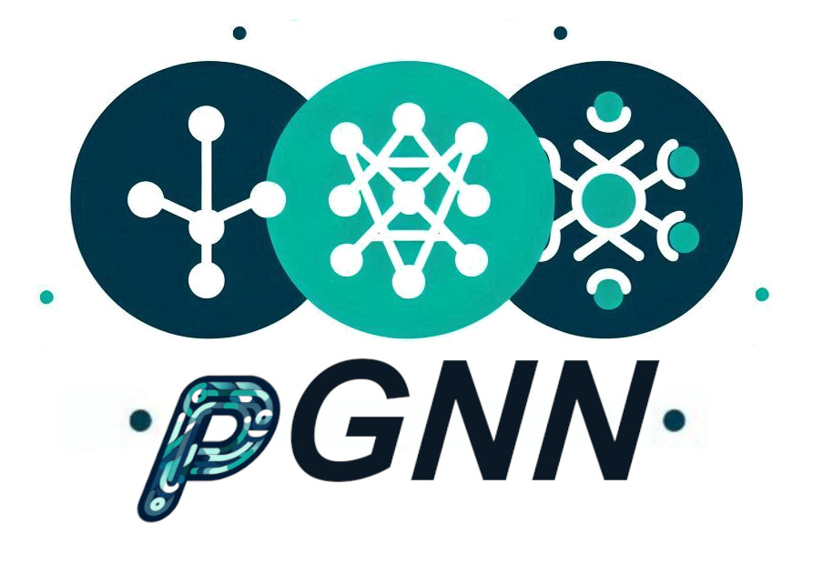

<div align="center">
    
    <br>
</div>  
  
# pGNN

## Overview

pGNN is a featurizer tool that leverages pretrained graph-neural networks (GNNs) to extract valuable information from materials structures. It aims to enhance the performance of materials property prediction models by generating highly meaningful features that can be used in a variety of machine learning tasks.

## Available Featurizers

pGNN offers multiple types of feature extraction tools to provide flexibility for various use cases:

- **MVLFeaturizer**: The `MVLFeaturizer` provides features extracted from various pretrained MEGNet models. These models have been trained on diverse datasets and offer reliable features for a wide range of properties. Users can choose between different intermediate layers to extract features from the regression head of the MEGNet models with either a 16-neuron or 32-neuron configuration.

- **CustomMEGNetFeaturizer**: The `CustomMEGNetFeaturizer` allows users to load custom models from the custom\_models/ directory. These models can incorporate encoded chemical information derived from extensive featurizers such as MatMiner (l-MM, `MatMinerEncoded\_v1` model) and Orbital Field Matrix (l-OFM, `OFMEncoded\_v1` model), providing tailored feature extraction for diverse use cases.

- **AdjacentMEGNetFeaturizer**: The `AdjacentMEGNetFeaturizer` is designed to train a MEGNet model on the fly for the user's dataset. This is particularly useful for ensuring that the features extracted are closely aligned with the dataset at hand, thus reducing potential bias and improving model accuracy. Similar to the other featurizers, users can choose to extract features from either the 16-neuron or 32-neuron layer.

## Installation

To install pGNN, clone the repository and use the following command:

```bash
pip install -r requirements.txt
```

Ensure you have all the necessary dependencies installed, including TensorFlow, scikit-learn, and the necessary MEGNet libraries.

## Usage

### Basic Example

Here's an example of how to use pGNN to extract features from a list of structures:

```python
from pgnn import MVLFeaturizer, AdjacentMEGNetFeaturizer
from pgnn import get_Custom_MEGNetFeatures

# Initialize featurizers
mvl32 = MVLFeaturizer(layer_name='layer32')
mvl16 = MVLFeaturizer(layer_name='layer16')
adj_megnet = AdjacentMEGNetFeaturizer(layer_name='layer32')

# Example structures
structures = pd.DataFrame({'structure': [...]})  # Replace '...' with your actual list of structures

# Extract features using MVLFeaturizer
features_32 = mvl32.get_features(structures)
features_16 = mvl16.get_features(structures)

# Train the AdjacentMEGNetFeaturizer on the fly
# Provide in 'targets' some property values corresponding to these structures
adj_megnet.train_adjacent_megnet(structures, targets=[...])

# Extract features using the trained AdjacentMEGNetFeaturizer
features_adj = adj_megnet.get_features(structures)

# Load features using custom model
features = get_Custom_MEGNetFeatures(structures, model_type='OFMEncoded_v1')
```

## Contributions

We welcome contributions to improve the pGNN tool, including adding more pretrained models or enhancing the featurization techniques. Please feel free to submit pull requests or create issues for discussion.

## License

This project is licensed under the MIT License.

## Acknowledgments

The pGNN tool is built on top of the MEGNet framework, leveraging its pretrained models to provide state-of-the-art features for materials science research. We thank the Materials Virtual Lab for making the pretrained models publicly available.
